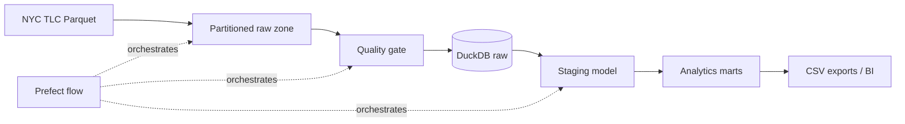

# NYC Taxi Analytics Data Pipeline

A portfolio-ready, local-first data engineering project that ingests monthly NYC Yellow Taxi
Parquet data, validates it, transforms it through layered warehouse models, and exports analytics
marts. It is intentionally small enough to run on a laptop while retaining production patterns:
partitioned raw storage, idempotent transformations, data-quality gates, orchestration, tests,
containers, and continuous integration.

## Architecture



| Layer | Purpose |
|---|---|
| `data/raw/year=YYYY/month=MM` | Immutable, partitioned source files |
| `raw.trips` | Source-aligned warehouse table plus ingestion metadata |
| `staging.trips` | Typed, filtered, analytics-ready trip records |
| `marts.daily_trip_metrics` | Daily volume, distance, duration, and revenue KPIs |
| `marts.payment_metrics` | Payment mix and revenue metrics |

## Quick start

Python 3.11+ is required. The sample mode is deterministic and does not use the network.

```bash
python -m venv .venv
source .venv/bin/activate
pip install -e ".[dev]"
taxi-pipeline --sample --year 2024 --month 1
```

The run creates:

- `data/warehouse.duckdb`, queryable with DuckDB or DBeaver
- `data/exports/daily_trip_metrics.csv`
- `data/exports/payment_metrics.csv`

### Verified sample result

The included 12-row fixture produces the following daily mart:

| trip_date | trip_count | avg_distance_miles | avg_duration_minutes | gross_revenue | avg_ticket |
|---|---:|---:|---:|---:|---:|
| 2024-01-01 | 8 | 2.03 | 11.5 | 116.60 | 14.58 |
| 2024-01-02 | 4 | 4.13 | 17.5 | 93.10 | 23.28 |

Source quality: 12 rows accepted, 0 invalid timestamp rows, and 0 negative-distance rows.

Run the real January 2024 partition:

```bash
taxi-pipeline --year 2024 --month 1
```

Or use Docker:

```bash
docker compose up --build
```

## Pipeline guarantees

- Downloads use a temporary `.part` file and atomic rename, so interrupted transfers do not
  masquerade as complete partitions.
- Existing source partitions are reused, making ingestion idempotent.
- A schema gate rejects missing required columns and records invalid timestamp/distance counts.
- Staging quarantines invalid timestamps, negative distances, and negative totals.
- `CREATE OR REPLACE` models make repeated transformations deterministic.
- Prefect tasks provide observability and ingestion retries.
- CI lints, tests, and executes the offline pipeline on every push and pull request.

## Verify and inspect

```bash
make lint
make test
duckdb data/warehouse.duckdb \
  "SELECT * FROM marts.daily_trip_metrics ORDER BY trip_date;"
```

## Repository layout

```text
src/taxi_pipeline/
  cli.py          command-line entry point
  flow.py         Prefect orchestration
  ingest.py       source download and sample generator
  quality.py      source contract and quality report
  transform.py    DuckDB model runner and mart export
  sql/            raw, staging, and mart SQL models
tests/             end-to-end pipeline tests
.github/workflows/ continuous integration
```

## Roadmap

1. Add dbt model contracts and lineage documentation.
2. Add incremental multi-month loads and ingestion audit tables.
3. Publish marts to a cloud warehouse and raw files to object storage.
4. Add a dashboard and scheduled deployment.
5. Add freshness alerts and pipeline backfills.

Data source: [NYC Taxi & Limousine Commission trip records](https://www.nyc.gov/site/tlc/about/tlc-trip-record-data.page).
